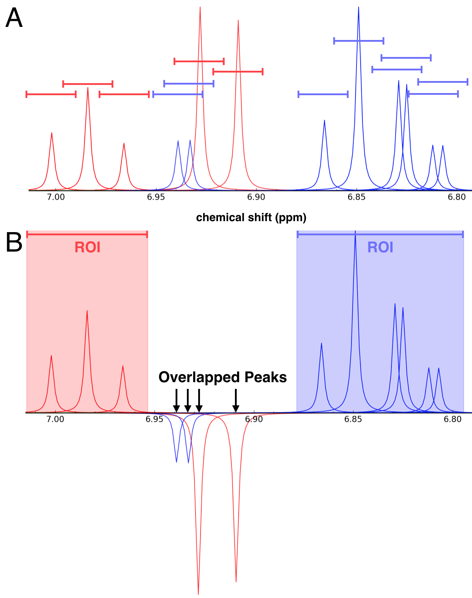
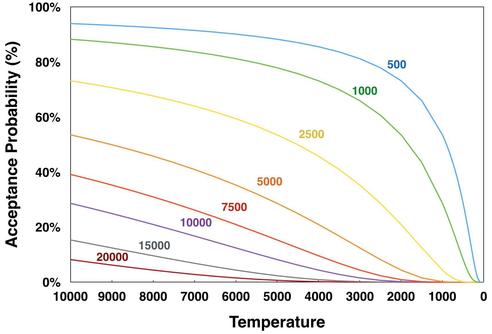

Background
==========

Introduction
------------

Ligand affinity screening by nuclear magnetic resonance (NMR) spectroscopy is a versatile tool that is routinely
used to support drug discovery and functional genomics research. The real power of NMR ligand affinity screens arises
from its ability to directly detect protein-ligand binding events under native or near-native sample conditions. The
most common NMR screening approaches (*i.e.* line-broadening, STD-NMR, and WaterLOGSY) are focused on detecting changes
in the one-dimensional (1D) |1H| spectrum of a ligand upon binding to a protein. Hundreds of compounds can be analyzed
in a day by coupling these benefits with an automated sample changer, software to optimize probe tuning and other
parameters, and rapid NMR data collection of with a cryogenic probe.

To improve the efficiency of NMR ligand affinity screens, compounds are usually evaluated in mixtures. Using mixtures
provides two significant benefits: (1) a larger number of compounds can be screened in a shorter amount of time; and
(2) the amount of protein required for the entire screen is reduced. However, there are also some drawbacks. As the
size of a mixture increases, the probability that a mixture might contain more than one compound competing for the
same binding site increases, thus weakening the NMR observable binding event for each compound. Also, compounds in
the same mixture may react or interact with each other, thus chemically changing the compounds or causing problems
with solubility or aggregation. Finally, the NMR signals from the multiple compounds may overlap leading to ambiguity
in analyzing the binding results and the necessity for rescreening with individual compounds. This last problem can
be overcome by creating mixtures without peak overlaps, but this task becomes challenging when one is working with a
screen composed of hundreds or thousands of compounds. However, a previous study showed that mixtures with minimal
peak overlap could be efficiently created by using a simulated annealing algorithm.

NMRmix is a freely available, open-source software solution for the generation of mixtures with minimal peak overlap.
NMRmix was written in `Python`_ and utilizes the `Qt`_ framework with `PyQt`_ bindings to build a graphical user
interface. NMRmix utilizes a combination of 1D |1H| peak lists for each compound and an overlap range to define whether
overlaps occur. The overlap scoring function considers the proportion of peaks in a compound that are overlapped as
well as the intensity of the peaks. The software has customizable parameters, downloadable peak list data from the
`BMRB`_ or `HMDB`_, interactive simulated spectra views, graphs of statistics, and an easily useable interface.
Additionally, NMRmix outputs regions of interest (ROIs) in a readable format that can be used to automate the
analysis of NMR ligand affinity screening data.

Defining Overlaps
-----------------

To determine whether an overlap occurs in a mixture, each |1H| NMR signal in each compound is assigned a spectral range
defined by a tolerance *δ* (in ppm) added to and subtracted from its chemical shift value *c* (*c* ± *δ* in ppm). This
user-defined overlap range effectively represents the spectral region belonging to each peak of a compound. An overlap
in a mixture occurs when the overlap range of a peak for one compound overlaps with the overlap range of a peak from a
different compound. Overlaps are not registered when evaluating peaks from the same compound. The overlap range can be
set independently for each peak in a compound, or a single global value for all peaks can be used.

Scoring Overlaps
----------------

    (A) Simulated 1D |1H| NMR spectrum of a mixture containing phenol (red peaks) and 4-chlorocatechol (blue peaks). The
    colored lines centered above each peak, which represent overlap ranges of 0.025 ppm, define the overlap regions.
    (B) This same mixture as viewed in NMRmix: peaks from different compounds whose ranges overlap are inverted; and,
    elsewhere, overlapping peak ranges from a given compound form a region of interest (ROI) for that compound.

The goal of generating mixtures with no overlaps is frequently not achievable, owing to the number of compounds in each
mixture and the distribution of |1H| NMR chemical shifts in the compound library. Overlaps that do occur should not
represent a significant proportion of the peaks belonging to any one compound in the mixture to minimize the ambiguity
in identifying compounds in a mixture. Therefore, instead of using the total number of overlaps to optimize the
mixtures, NMRmix uses a scoring function based on the proportion of peaks in each compound that are overlapped:

:math:`S_C = k\frac{N_O}{N_T}`

where |SC| represents the overlap score for the compound, k represents the score scaling function, |NO| represents the
number of peaks in the compound that are overlapped, and |NT| represents the total number of peaks in the compound. In
this approach, the penalty associated with an overlap is lower in a compound with a large number of peaks when compared
with a compound that has only a few or just one peak.

NMRmix also has the ability to use peak intensities as a factor in evaluating the optimization of mixtures. In most NMR
ligand-detect screening approaches (e.g., line-broadening, STD, or WaterLOGSY), identifying a binding event depends on
monitoring changes in the line width, intensity, or position of peaks belonging to a compound. The presence of nearby
strong signals can hinder the detection of such changes in weak signals. To minimize this problem, NMRmix offers an
optional scoring function (|SC|\*) for use in optimizing mixtures:

:math:`S_C^* = k\frac{I_O}{I_T}`

where |SC|\* represents the modified overlap score for the compound, k represents the score scaling function, |IO|
represents the sum of all of the intensities of the overlapped peaks in the compound, and |IT| represents the sum of all
of the intensities of all of the peaks in the compound.

Optimizing Mixtures
-------------------

The optimization of mixtures in NMRmix occurs through simulated annealing. In brief, a small number of compounds from
different mixtures are swapped during each step of the annealing process. The number of compounds being swapped
(the mixing rate) is a user-defined parameter that can be specified prior to optimization. After each annealing step,
the new arrangement of compounds in the mixtures is evaluated based on a total overlap score, which is either accepted
or rejected. This process continues until the maximum number of annealing steps (set by the user) is reached or stops
before if none of the mixtures contains overlaps.

The total overlap score (|ST|) used to evaluate each arrangement of compounds in the mixtures is simply the sum of all
of the overlap scores for each compound (|SC| or |SC|\*) in their respective mixtures:

:math:`S_T = \displaystyle \sum_{i=1}^{n} S_C`

During each step of the annealing process, if the total overlap score for the new arrangement of mixtures is less than
or equal to the total overlap score of the current arrangement of mixtures, the new arrangement is automatically
accepted; however, to minimize the possibility that the total overlap score for the mixtures becomes trapped in a local
minimum due to a particular arrangement of compounds in the mixtures, each step of the simulated annealing process in
which the total overlap score increases is evaluated according to a modified Boltzmann probability:

:math:`P = \displaystyle e^\frac{-k_T|ΔS_T| }{MT k_S}`

    Temperature dependence of the Boltzmann acceptance probability as a function of |dST|, the difference between the
    total overlap score of the new set of mixtures and that of the current set of mixtures, with |dST| values:
    (blue) 500; 1000 (green); 2500 (yellow); 5000 (orange); 7500 (red); 10000 (violet); 15000 (gray);
    and 20000 (maroon). The calculations of acceptance probabilities used the default values for the temperature
    scaling factor (25,000), score scaling factor (10,000), and mixing rate (2).

where P is the probability of acceptance, |dST| is the difference between the total overlap score of the new set of
mixtures and that of the current set of mixtures, |kT| is the temperature scaling factor, |kS| is the
score scaling factor, M is the mixing rate, and T is the step temperature. To facilitate the
calculation of a probability of acceptance, each annealing step is associated with a “temperature” value that decreases
on each successive step. At the beginning of the annealing process, when the temperature is higher, the probability for
accepting a more overlapped arrangement of compounds is greater. Even a new arrangement at a temperature of
10,000 that increases the total overlap score by 20,000 (equivalent to two completely overlapped compounds) still has
an 8.2% chance of acceptance. Each subsequent step of the annealing process lowers the temperature, thus lowering the
base acceptance probability. In most cases, once the temperature reaches approximately 100 (using default parameters),
the probability of acceptance becomes zero.

Summary
-------

NMRmix is a powerful, freely available, open-source tool for generating mixtures of small molecules with minimal NMR
peak overlap. The optimization of mixtures is accomplished by using a simulated annealing algorithm previously
described (Arroyo 2013). The user-friendly GUI facilitates easy mixture optimization and data analysis, and NMRmix only
requires information about the compound library and a source for reference 1D |1H| peak lists to get started.
Additionally, NMRmix introduces the concept of intensity scoring, which penalizes overlaps that occur on the most
intense peaks instead of treating overlaps of all peaks equally. After optimization, the resulting mixture table and
ROI list can be exported to an easily readable CSV format. The availability of the ROI list in an easily readable
format can also facilitate automation of data analysis for NMR-based ligand screening. The ranges of the ROI list can
be easily extracted through scripting and imported into various NMR analysis tools as integration regions to
automatically quantitate and compare spectra and identify hits. Future versions of NMRmix could include other non-NMR
criteria, such as reactivity, solubility, aggregation, or structural similarity, into the score for optimizing
mixtures. Additionally, NMRmix could be adapted toward optimizing mixtures for other nuclei used for NMR ligand
affinity screens such as |19F|-based screens.

.. topic:: Related References

   * Jaime L. Stark, Hamid R. Eghbalnia, Woonghee Lee, William M. Westler, and John L. Markley. `NMRmix: a tool for the
     optimization of compound mixtures for 1D 1H NMR ligand affinity screens.
     <http://pubs.acs.org/doi/abs/10.1021/acs.jproteome.6b00121>`_ *Journal of Proteome Research* (2016),
     15(4): 1360-1368.
   * Xavier Arroyo, Michael Goldflam, Miguel Feliz, Ignasi Belda, and Ernest Giralt. `Computer-Aided Design of
     Fragment Mixtures for NMR-Based Screening. <http://dx.plos.org/10.1371/journal.pone.0058571>`_ *PLoS ONE* (2013),
     8(3): e58571.

.. _Python: https://www.python.org
.. _Qt: http://www.qt.io
.. _PyQt: https://www.riverbankcomputing.com
.. _BMRB: http://www.bmrb.wisc.edu/metabolomics/
.. _HMDB: http://www.hmdb.ca

.. |1H| replace:: \ :sup:`1`\H
.. |19F| replace:: \ :sup:`19`\F
.. |SC| replace:: S\ :sub:`C`
.. |NO| replace:: N\ :sub:`O`
.. |NT| replace:: N\ :sub:`T`
.. |IO| replace:: I\ :sub:`O`
.. |IT| replace:: I\ :sub:`T`
.. |ST| replace:: S\ :sub:`T`
.. |dST| replace:: ΔS\ :sub:`T`
.. |kT| replace:: k\ :sub:`T`
.. |kS| replace:: k\ :sub:`S`