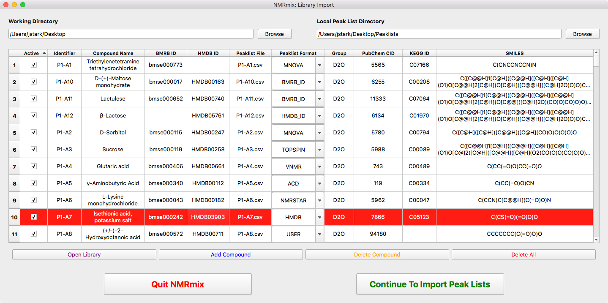
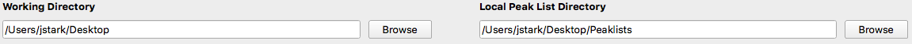
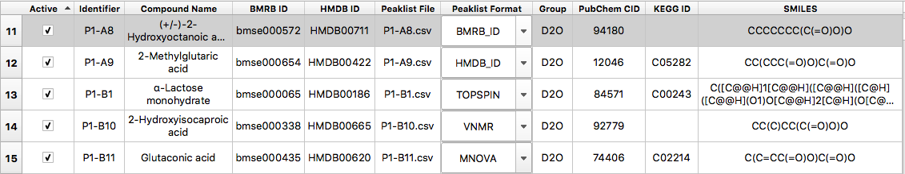

.. _compound-library-window:

The Compound Library Window
===========================

The compound library window is where the user will identify the compounds that will be used to make mixtures and associate
those compounds to a peak list. Additional information regarding grouping and/or structure can also be added. While the
adding of compounds can be done manually within NMRmix, it is often easier to generate a compound library file
(see :ref:`compound-table`) externally using a spreadsheet program like Excel then import that library into NMRmix.

.. _setting-working-peaklist-directories:

Setting Working and Peaklist Directories
----------------------------------------

Working Directory
    Setting the Working Directory determines where NMRmix will save results and figures. Additionally, it also sets
    the initial directory that NMRmix search to open the compound library file.

Local Peaklist Directory
    Setting the Local Peaklist Directory indicates where to find and save peak lists. Local peaklist files for
    each compound must be included in this folder. Even when using online sources for peaklists like BMRB and HMDB,
    the peaklists will be downloaded to the folder selected here.

.. _compound-table:

The Compound Table
------------------

The compound table represents the information for each compound that will be used to create optimal mixtures. Each row
of the compound table represents a single compound.
Compounds can be added to the compound table one-by-one within NMRmix through the use of **Add Compound** and editing the
individual fields. However, the easier way to add compounds is to create a library file and then import it into NMRmix.
The library file is a CSV
(Comma Delimited Values) file with a specific set of column headers that can be opened and edited within a spreadsheet
editor like Excel. For a description of these columns, see :ref:`compound-library-fields`.

.. note::
    The values that exist within the compound table when peak lists are imported will be exported as a new library
    file when NMRmix outputs the optimization results (see :ref:`nmrmix-results`). This will allow you to maintain the
    state of the library used for each use of NMRmix.

.. sidebar:: Example Library Files

    An empty compound library file with all of the correct headers that can be edited in spreadsheet software to add
    your own compounds.

    :download:`Download Empty Library File <../_static/library/library.csv>`

    An example compound library file that contains all of the metabolites from the BMRB that have |1H| chemical shifts.

    :download:`Download BMRB Library File <../_static/library/BMRB-Library.csv>`

Open Library
    Opens a file dialog window to select the library file to import. The file must be in the comma delimited format
    (CSV). Upon opening the library file, the contents of the compound table will be erased and replaced with
    the contents of the newly imported library file.

Add Compound
    Add an empty row to the end of the compound table where details of a new compound can be added.

Delete Compound
    Deletes the currently selected row. The currently selected row will be highlighted.

Delete All
    Removes all compounds from the compound table.

Once all of the information for the compounds to be mixed has been added, pressing **Continue to Import Peak Lists**
will open the window to :ref:`importing-peaklists`. Any compound that has an empty identifier/compound name or
has a duplicate identifier will pop up an error message. Compounds without any peak list information will fail
during the peak list import.

.. _compound-library-fields:

Compound Library Fields
-----------------------

Active
    Indicates whether the compound should be included for import and use in the mixtures. Active compounds will have
    peak lists imported and will be available in later components of NMRmix. Inactive compounds will not have their
    peak lists imported and will be ignored from the rest of the NMRmix process. Setting a compound to ignore allows for
    a compound to remain in the library, but be easily excluded from the compound currently being screened. This is
    useful in cases when there is no more stock solution of a compound or a screen only wants to screen particular types
    of compounds.

Identifier
    The identifier is as *unique* string of characters that represents the compound. Ideally, the identifier should be
    kept to a low number of characters (< 10 characters) and should represent the compound beyond just one screen.
    Typical examples for a unique ID may be database identifiers, plate-well designations, inventory catalog numbers,
    etc. This is a *required* field.

Compound Name
    The name of the compound being screened. The is a *required* field but does not need to be unique.

BMRB ID
    The BMRB ID allows for compounds with 1H peak lists in the BMRB to be downloaded. The BMRB ID should follow the
    format of **bmseXXXXXX**, where the **XXXXXX** represents the six digit BMRB ID number. This field is *optional*
    if another peak list source exist.

HMDB ID
    The HMDB ID allows for compounds with 1H peak lists in the HMDB to be downloaded. The HMDB ID should follow the
    format of **hmdbXXXXX**, where the **XXXXX** represents the five digit HMDB ID number. This field is *optional*
    if another peak list source is available.

Peaklist File
    The filename, including extension, of the file containing the peak list data. These files should be located in the
    folder indicated for the Local Peaklist Directory (see :ref:`setting-working-peaklist-directories`).
    This field is *optional* if another peak list source is available through BMRB or HMDB.

Peaklist Format
    Indicates where to get the peak list data for the compound and what format the data is in.

    BMRB ID
        Must have BMRB ID field filled. It initially search for bmrbXXXXXX.str file in Local Peaklist
        Directory. If it exists, it will use that file, otherwise it will attempt to find the peak list associated with
        the BMRB ID online, and download the bmrbXXXXXX.str file to the Local Peaklist Directory. This option
        *may require* an internet connection.

    HMDB ID
        Must have HMDB ID field filled. It initially search for hmdbXXXXX.txt file in Local Peaklist
        Directory. If it exists, it will use that file, otherwise it will attempt to find the peak list associated with
        the HMDB ID online, and download the hmdbXXXXX.txt file to the Local Peaklist Directory. This option
        *may require* an internet connection.

    TOPSPIN
        The file indicated in the Peaklist File field is in the :ref:`bruker-topspin` format.
        If this option is chosen, the Peaklist File field must be filled with a valid file name.

    VNMR
        The file indicated in the Peaklist File field is in the :ref:`agilent-vnmrj` format.
        If this option is chosen, the Peaklist File field must be filled with a valid file name.

    MNOVA
        The file indicated in the Peaklist File field is in the :ref:`mestrelab-mnova` format.
        If this option is chosen, the Peaklist File field must be filled with a valid file name.

    ACD
        The file indicated in the Peaklist File field is in the :ref:`acd-nmr-processor` format.
        If this option is chosen, the Peaklist File field must be filled with a valid file name.

    NMRSTAR
        The file indicated in the Peaklist File field is in the :ref:`nmrstar-format` format.
        If this option is chosen, the Peaklist File field must be filled with a valid file name.

    HMDB
        The file indicated in the Peaklist File field is in the :ref:`hmdb-format` format.
        If this option is chosen, the Peaklist File field must be filled with a valid file name.

    USER
        The file indicated in the Peaklist File field is in the :ref:`user-defined-format` format.
        If this option is chosen, the Peaklist File field must be filled with a valid file name.

Group
    Adding a group name to a compound indicates that the compound belongs to that group. This is useful in cases where
    some compounds of one group are not allowed to be considered in mixtures that contain a compound of another group.
    One common group classification is the solvent used to create the stock solution of the compound. It may be desirable
    to not mix compounds dissolved in |D2O| with compounds dissolved in DMSO.

    Adding a group to a compound does not automatically keep different groups from mixing. The effects of grouping are
    not turned on until the option is selected when :ref:`setting-ignore-regions` or restricting by group
    in :ref:`optimization-settings`.

    Note that any compound that does not have a group entered in this field when grouping is turned on is considered a
    member of the N/A group.

PubChem CID
    This field allows a `PubChem Compound ID <https://pubchem.ncbi.nlm.nih.gov/help.html#fCompound>`_ (CID) to be
    associated with the compound. Currently, this value does not have any functionality in NMRmix, but may be used
    in future versions to populate information about the compound.

KEGG ID
    This field allows a `KEGG COMPOUND ID <http://www.genome.jp/kegg/compound/>`_ to be
    associated with the compound. Currently, this value does not have any functionality in NMRmix, but may be used
    in future versions to populate information about the compound, such as biochemical pathways.

SMILES
    The `simplified molecular-input line-entry system (SMILES) <https://en.wikipedia.org/wiki/Simplified_molecular-input_line-entry_system>`_
    1D representation of the compound. This used to provide 2D molecular structure representation in the NMRmix user
    interface.

Notes
    Allows for general text notes to be stored for each compound. This field is not currently used in NMRmix.

.. |D2O| replace:: D\ :sub:`2`\O
.. |1H| replace:: :sup:`1`\H