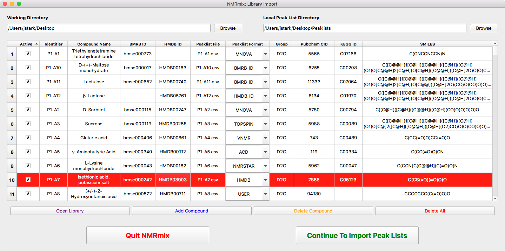
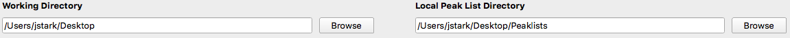
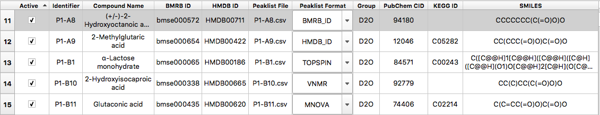

.. _compound-library-window:

The Compound Library Window
===========================

The compound library window.

.. _setting-working-peaklist-directories:

Setting Working and Peaklist Directories
----------------------------------------

Working and peaklist directories

Working Directory
    stuff

Local Peaklist Directory
    stuff

.. _compound-table:

The Compound Table
------------------

The compound table

Open Library
    stuff

Add Compound
    stuff

Delete Compound
    stuff

Delete All
    stuff

.. _import-compound-library:

Importing a Compound Library
----------------------------

Importing the compound library.

Active
    Indicates whether the compound should be included for import and use in the mixtures.

Identifier
    The identifier is as *unique* string of characters that represents the compound. Ideally, the identifier should be
    kept to a low number of characters (< 10 characters) and should represent the compound beyond just one screen.
    Typical examples for a unique ID may be database identifiers, plate-well designations, inventory catalog numbers,
    etc. This is a required field.

Compound Name
    The name of the compound being screened. The is a required field but does not need to be unique.

BMRB ID
    stuff

HMDB ID
    stuff

Peaklist File
    stuff

Peaklist Format
    stuff

Group
    stuff

PubChem CID (not currently implemented)
    stuff

KEGG ID (not currently implemented)
    stuff

SMILES
    stuff

Notes (not currently implemented)
    stuff