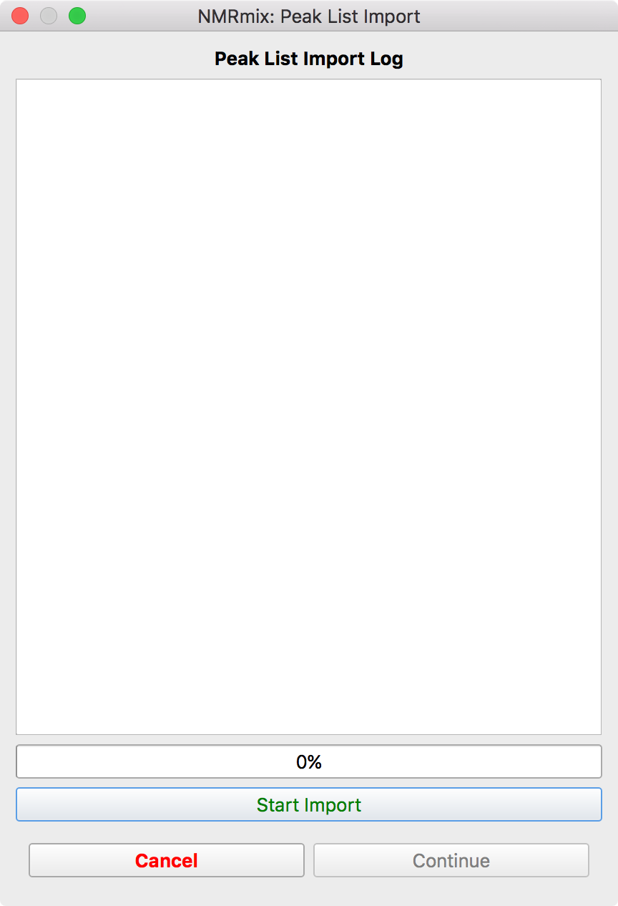
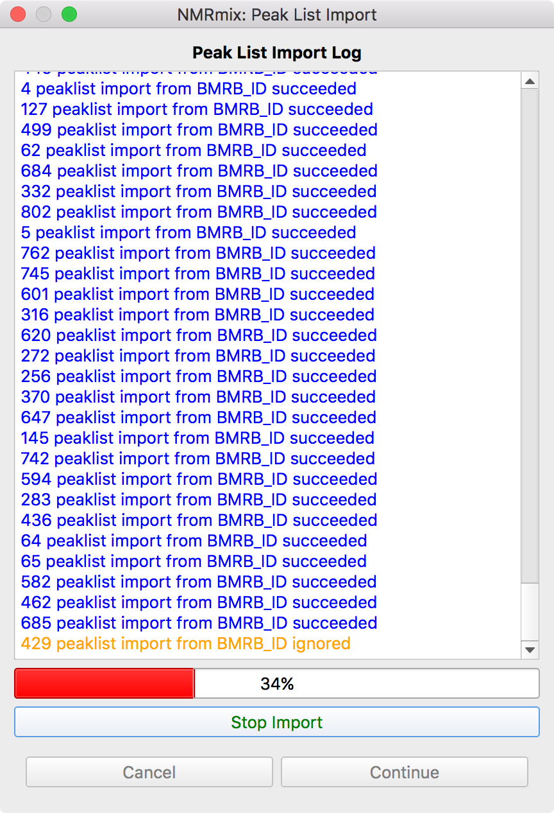
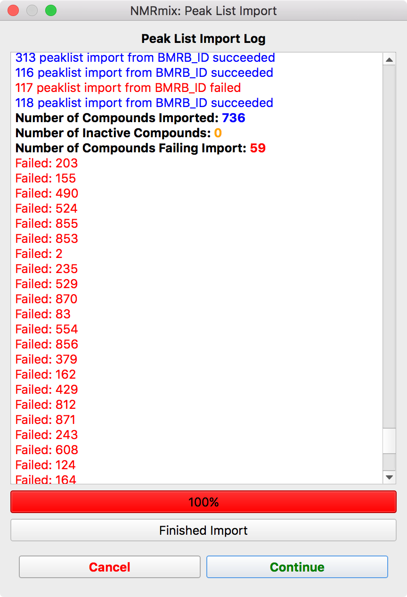

.. _importing-peaklists:

Importing Peaklists
===================

The peaklist import window shows the progress of importing the peak lists from the locations specified in the compound
library file.

To begin the import process, click the **Start Import** button (left figure). After clicking this button, the
import process should begin. The log window will show the importing results for each compound in the compound library
(center figure).
If the peaklist was successfully imported, the log output will be blue or black. If the compound was set to be not
active in the compound library and thus ignored, the log output will be orange. Finally, if the peaklist failed to
import for a compound, the log output will be red. The importing process
can be stopped by pressing the **Stop Import** button. Upon completing the import process, a short summary of the
number of compounds that succeeded, were ignored, or failed will appear, followed by a list of the compound unique
identifiers that failed (right figure).

Pressing the **Cancel** button will back out of the peaklist import window returns to the compound library window.
This allows you to fix any compounds that failed to import by checking the filename, file format, or verifying
BMRB/HMDB IDs.

Pressing **Continue** will accept the current results of the import process, close the window, and
continue with :ref:`peaklist-statistics-window`.

.. warning::
    Compounds that fail to import are treated as if they are inactive in the library. They are set to inactive in the
    compound library file that is exported in the NMRmix results. Cancel out of the peaklist import window to fix these
    issues, if necessary.

.. note::
    A log file will be generated for this import process when NMRmix results are created.

.. _peaklist-formats:

Peaklist Formats
----------------

Peaklist Formats

.. _acd-nmr-processor:

ACD NMR Processor
^^^^^^^^^^^^^^^^^

The ACD NMR Processor format

:download:`Download Example ACD Peaklist <../_static/peaklists/acd.csv>`

.. _hmdb-format:

HMDB
^^^^

The HMDB format

:download:`Download Example HMDB Peaklist <../_static/peaklists/hmdb00163.txt>`

.. _mestrelab-mnova:

Mestrelab Mnova
^^^^^^^^^^^^^^^

The Mestrelab Mnova format

:download:`Download Example Mnova Peaklist <../_static/peaklists/mnova.csv>`

.. _nmrstar-format:

NMRSTAR (v3)
^^^^^^^^^^^^

The NMRSTAR format

:download:`Download Example NMRSTAR Peaklist <../_static/peaklists/bmse000652.str>`

.. _bruker-topspin:

Bruker TopSpin (v3)
^^^^^^^^^^^^^^^^^^^

The Bruker TopSpin format

:download:`Download Example TopSpin Peaklist <../_static/peaklists/topspin.xml>`

.. _agilent-vnmrj:

Agilent VnmrJ
^^^^^^^^^^^^^

The Agilent VnmrJ format

:download:`Download Example VnmrJ Peaklist <../_static/peaklists/vnmr.peaks>`

.. _user-defined-format:

User-Defined
^^^^^^^^^^^^

The User-Defined format

:download:`Download Example Mnova Peaklist <../_static/peaklists/user.csv>`

